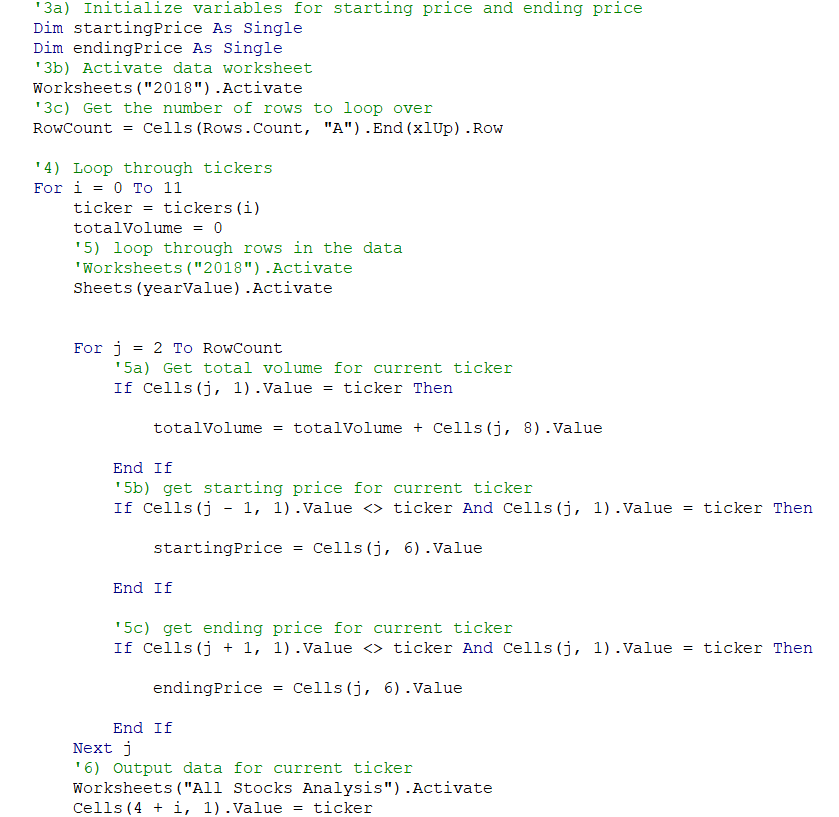
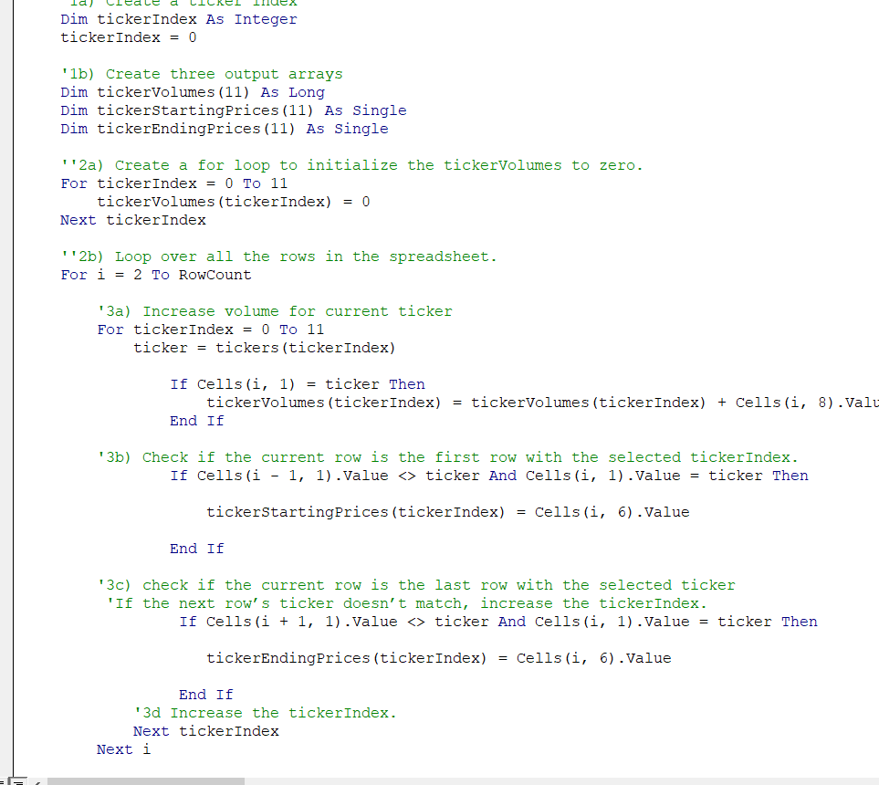
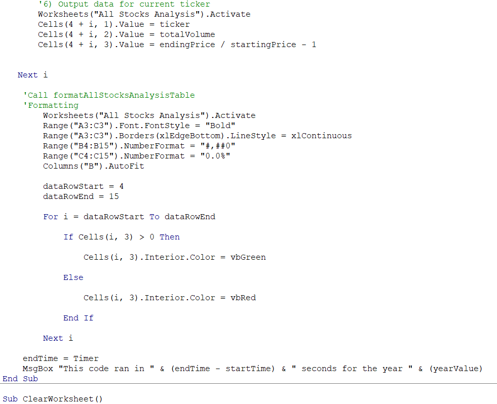
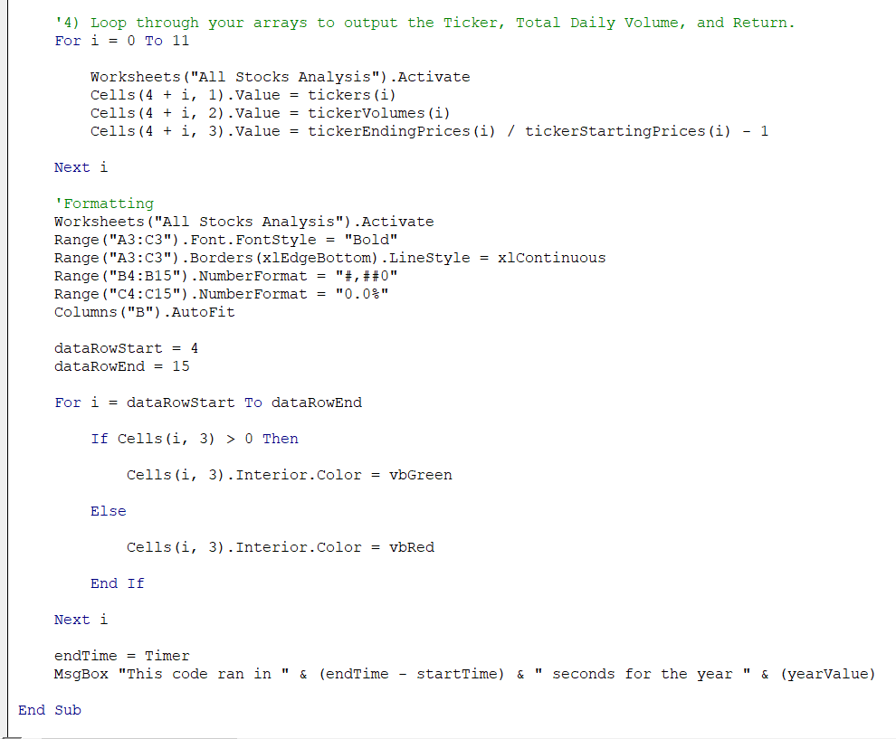
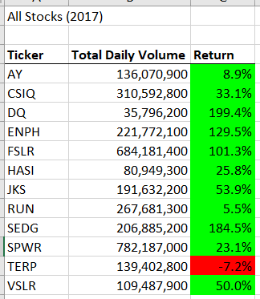
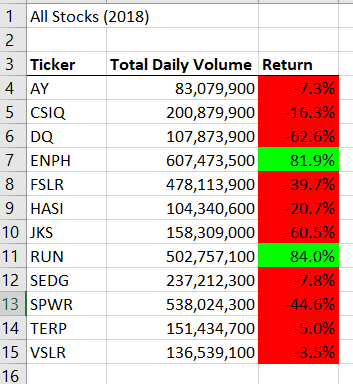

# Refactor VBA Code and Measure Performance

## Overview of Project
### Purpose

Refactoring is a key part of the coding process. So refactoring the existing code for efficient and for the better performance.

### Background

Steve, who is just graduated from the finance degree, started analyzing a dozen of green energy stocks for the year 2017 and 2018 for his parents. Macros are enabled to analyze data in the future. He wants to expand the dataset to include the entire stock market over the last few years. Although our code works well for a dozen stocks, it might not work as well for thousands of stocks. And if it does, it may take a long time to execute. So we are trying to refactoring the VBA code for stock analysis to improve and for the faster performances.

## Results
In the module2, we ran the VBA code through every row of the sheet for each ticker. Using our knowledge of VBA and the starter code provided in this Challenge to refactor the Module2_VBA_Script by looping through the data one time and collect all of the information. So refactored code run faster and efficient than it did in this module. Compare the stock performance between 2017 and 2018, as well as the execution times of the original script and the refactored script.

 
 
 ###  Analysis

1. Created a tickerIndex variable and set it equal to zero before iterating over all the rows.
2. Created the tickers array as tickerIndex and the three output arrays, tickerVolumes, tickerStartingPrices, and tickerEndingPrices.
3. Created a for loop to initialize the tickerVolumes to zero and a for loop that will loop over all the rows in the spreadsheet.
4. A script is created that increases the current tickerVolumes (stock ticker volume) variable and adds the ticker volume for the current stock ticker. tickerVolumes(tickerIndex) = tickerVolumes(tickerIndex) + Cells(i, 8).Value
5. if-then statement to check if the current row is the first row/lastRow with the selected tickerIndex. If it is, then assign the current starting price/ending price to the corresponding tickerStartingPrices or tckerEndingPrice variables
6. Used a for loop to loop through your arrays (tickers, tickerVolumes, tickerStartingPrices, and tickerEndingPrices) to output the “Ticker,” “Total Daily Volume,” and “Return” columns in your spreadsheet.

  There is no change in fornmatting code. Both the original module_2 code and the refactored code is as below.


Oiginal Script             |  Restored Script
:-------------------------:|:-------------------------:
  |  


Oiginal Script             |  Restored Script
:-------------------------:|:-------------------------:
  |  


Comparition of the stock performance between 2017 and 2018 as well as the execution times for the original script and the refactored script is as below,

  2017 Stock Performance           |  2018 Stock Performance
:-------------------------:|:-------------------------:
  |  


Comparition of the execution times for the original script and the refactored script is as below,


Excecution Time comparition for 2017 and 2018 stocks

Year   |  Execution Time in Original Script (sec)| Execution Time in Restored Script (sec)
:------|---------------------------------:|:---------------------------------:
2017   |```0.79687``` | ```0.59375```
2018   |```0.78125``` | ```0.58593```


 1. The stock performance is much better in year 2017 than 2018. 
 2. The execution time for the refactored script is faster than the original script.
 

## Summary
## The advantages and disadvantages of refactoring code in general
### Advantage
 Refactoring your code successfully made the VBA script run faster. Refactoring is a key part of the coding process. When refactoring code, we need to make the code more efficient by taking fewer steps or improving the logic of the code to make it easier for future users to read.

### Disadvantage
Inaccurate refactoring code can introduce new bugs and errors into the code, it is important to keep track of changes or we need to rewrite the code.


## The advantages and disadvantages of the original and refactored VBA script
### Advantage
The advantage of refactoring the original code was we improved our execution time for script. It loops through all the data only once and collect the same information. This will allow us to work with bigger data sets in the future while being more efficient.

### Disadvantage
Refactored code has more loops and more arrays. It's a bit complex to understand the array of variables. There will always be potential that the refactored code may not be more efficient. So we need to save the original code before refactoring just in case.


 
 
  

